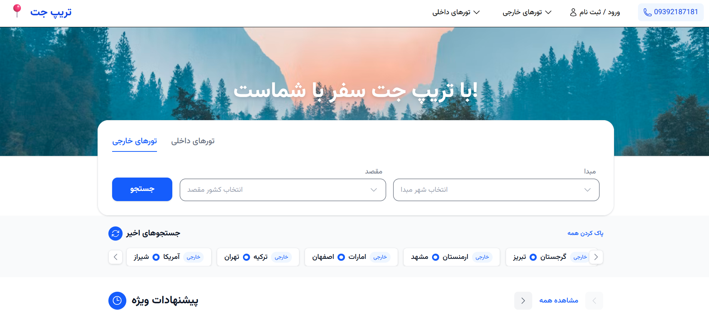
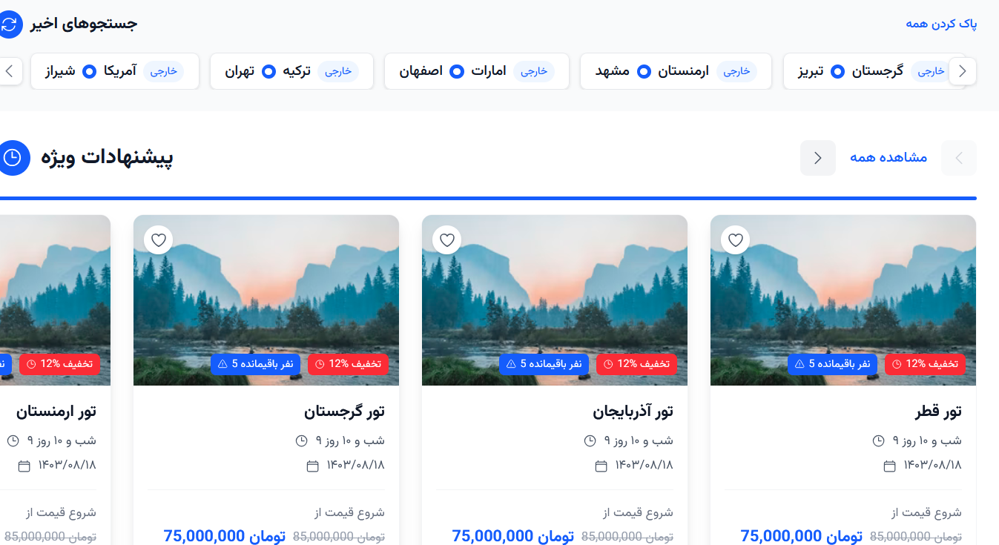
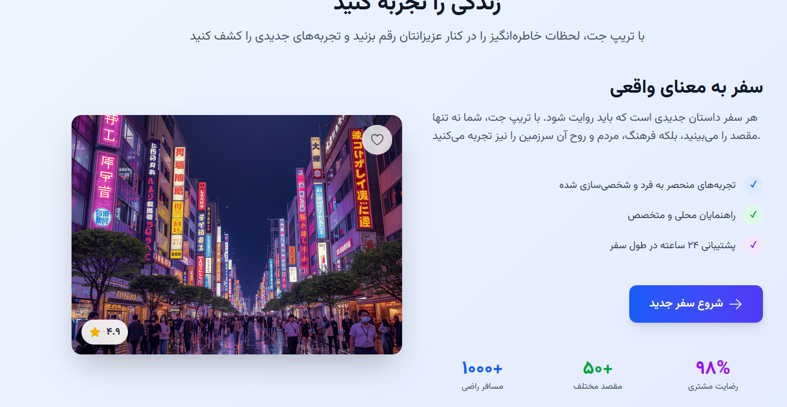
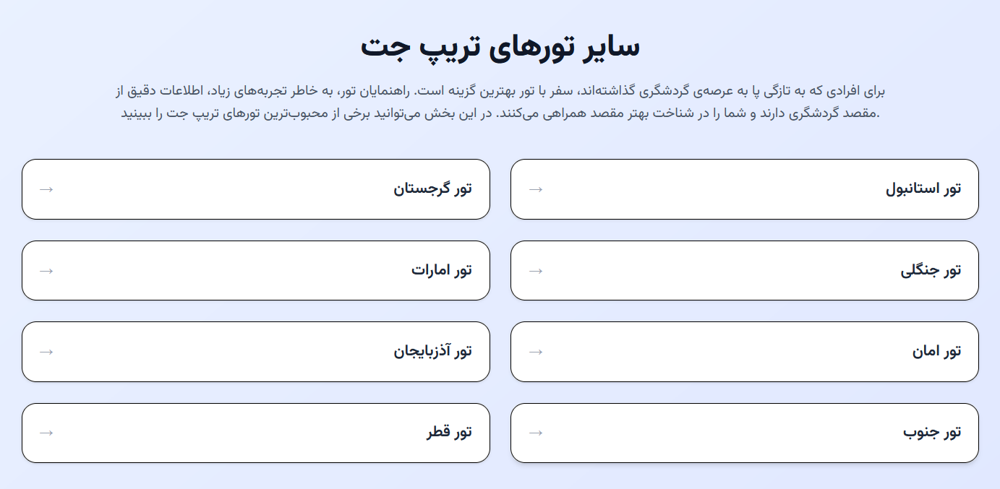
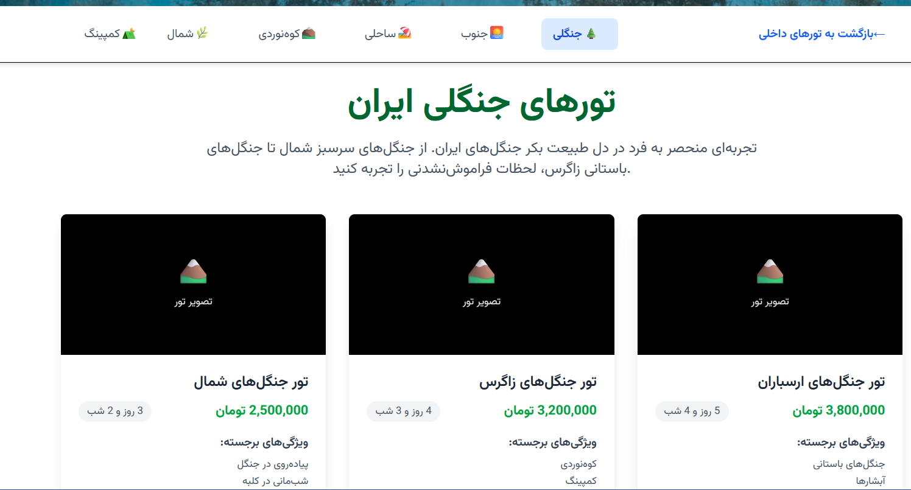
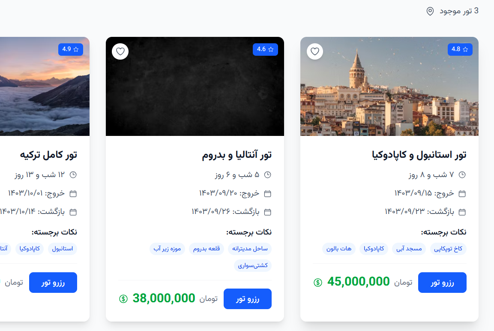

# 🧳 TripChat – Travel & Tour Booking Platform

**TripJet** is a modern web application for booking, and exploring special travel offers for both domestic and international destinations.  
It features a clean, responsive, and user-friendly interface designed to provide a smooth travel planning experience.

## ✨ Features

- 🎯 **Special Offers Section** – Display discounted tours with price details.
- 📅 **Tour Details** – Duration, departure date, price, and discount percentage.
- 🖼 **Attractive Visuals** – High-quality images for each destination From Unsplash.
- 📊 **Modern UI** – Minimal and responsive design for all devices (Progress).

## 🛠 Tech Stack

- **Frontend:** React.js + Vite
- **Styling:** CSS Modules / TailwindCSS 
- **Routing:** React Router

## 📂 Project Structure

```
src/
│
├── assets/            # Static images and media
├── components/        # Reusable UI components (Header, Footer, etc.)
├── pages/             # Main pages (SpecialOffers, Home, etc.)
│   ├── SpecialOffers/  # Special offers listing page
│   └── ...
├── data/              # Static data files (specialOffers.js)
├── App.jsx            # Main app component
└── main.jsx           # Application entry point
```

## 🚀 Getting Started

### 1. Clone the repository

```bash
git clone https://github.com/unkmitm/tour.git
cd front
```

### 2. Install dependencies

```bash
npm install
```

### 3. Run the development server

```bash
npm run dev
```

## 📸 Screenshots







